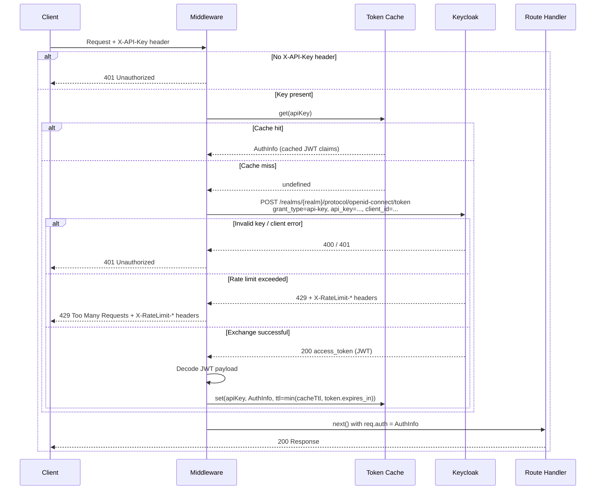
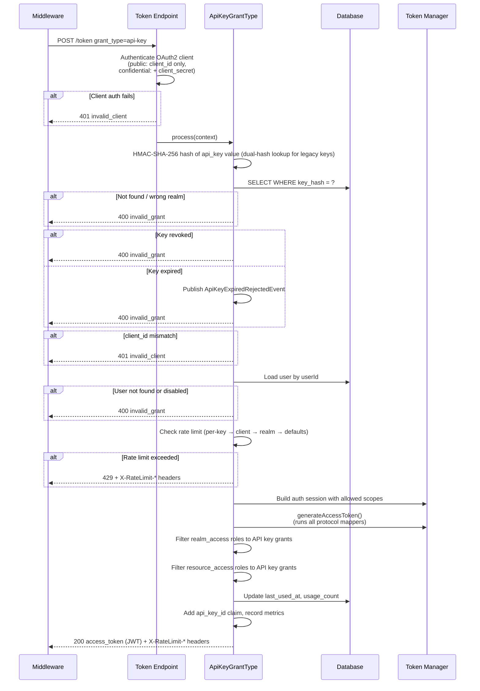

# keycloak-api-keys

Keycloak extension for API key management — generate, validate, and exchange API keys for JWT tokens.

## Overview

This project extends Keycloak with API key capabilities, allowing users to generate API keys that can be exchanged for JWT tokens. API keys are scoped to specific clients and can have granular permissions.

## Components

| Module | Language | Description |
|--------|----------|-------------|
| `keycloak-api-keys-spi` | Java | Keycloak server extension (storage, REST API, token exchange) |
| `keycloak-api-keys-account-ui` | TypeScript | Account Console UI extension for user self-service |
| `keycloak-api-keys-admin-ui` | TypeScript | Admin Console UI extension for administrators |
| `keycloak-api-keys-spring` | Java | Spring MVC / servlet security integration |
| `keycloak-api-keys-spring-webflux` | Java | Spring WebFlux reactive security integration |
| `keycloak-api-keys-express` | TypeScript | Express.js middleware |
| `keycloak-api-keys-fastify` | TypeScript | Fastify plugin |
| `keycloak-api-keys-hono` | TypeScript | Hono middleware (edge-ready) |
| `EmDzej.KeycloakApiKeyAuthentication` | C# | ASP.NET Core authentication handler |
| `express-demo` | TypeScript | Demo app — Express.js (port 3001) |
| `fastify-demo` | TypeScript | Demo app — Fastify (port 3002) |
| `hono-demo` | TypeScript | Demo app — Hono (port 3003) |
| `spring-demo` | Java | Demo app — Spring Boot MVC (port 3004) |
| `spring-webflux-demo` | Java | Demo app — Spring Boot WebFlux (port 3005) |
| `KeycloakApiKeyAuthentication.Demo` | C# | Demo app — ASP.NET Core Minimal API (port 3006) |

## Documentation

- [Specification](docs/SPEC.md)
- [API Reference](docs/API.md)

## Local Development

### Prerequisites
- Java 21
- Node.js 22+
- pnpm
- .NET 10 SDK
- Docker & Docker Compose

### Quick Start

```bash
# Install dependencies
pnpm install

# Build and run Keycloak with extensions
./scripts/dev.sh

# Or build only
./scripts/build.sh
```

Keycloak will be available at http://localhost:8080
- Admin Console: http://localhost:8080/admin
- Account Console: http://localhost:8080/realms/master/account
- Credentials: admin / admin

### Development Workflow

1. Make changes to SPI code (spi/src/...)
2. Run `./scripts/build.sh`
3. Restart Keycloak: `docker compose -f docker-compose.dev.yml restart keycloak`

For UI changes, the build output goes directly to theme resources, so just rebuild and refresh the browser.

## How It Works

### Middleware Request Flow

Every inbound request to a protected route goes through the following steps:



### Keycloak Token Exchange Flow

When the middleware calls Keycloak to exchange an API key, the following happens inside the Keycloak SPI:



### Token Claims

The JWT returned by the exchange contains the standard Keycloak claims plus:

| Claim | Value |
|-------|-------|
| `sub` | User ID (key owner) |
| `azp` | Client ID the key is bound to |
| `api_key_id` | ID of the API key used |
| `scope` | Intersection of key scopes and client scopes resolved by Keycloak's mapper pipeline |
| `realm_access.roles` | Intersection of mapper-produced roles and API key's granted roles |
| `resource_access` | Same intersection for client roles |

## Demo Applications

Each middleware package has a companion demo app that shows a working API protected by API key authentication. All demos expose the same four endpoints:

| Route | Auth | Description |
|-------|------|-------------|
| `GET /health` | Public | Liveness check |
| `GET /api/profile` | Required | Returns JWT claims from the exchanged token |
| `GET /api/data` | Required | Returns a sample item list |
| `POST /api/echo` | Required | Echoes the request body |

### Prerequisites

Keycloak must be running locally with the SPI installed:

```bash
docker compose up -d
```

Then create an API key via the Account Console (`http://localhost:8080/realms/master/account`) or via the REST API.

> **Client authentication note**
>
> The token exchange endpoint (`/realms/{realm}/protocol/openid-connect/token`) authenticates the client before the API key grant runs — this is standard OAuth2 behaviour enforced by Keycloak.
>
> - **Public clients** (e.g. `admin-cli`, `account-console`) — no `client_secret` needed, just `client_id`
> - **Confidential clients** — `client_secret` must be included in the request body
>
> The API key must have been created for the same `client_id` that is sent in the exchange request. The middleware packages accept an optional `clientSecret` option — omit it for public clients, provide it for confidential ones.

```bash
# Get a token first
TOKEN=$(curl -s -X POST http://localhost:8080/realms/master/protocol/openid-connect/token \
  -d "client_id=admin-cli&grant_type=password&username=admin&password=admin" \
  | jq -r .access_token)

# Create an API key
curl -s -X POST http://localhost:8080/realms/master/api-keys \
  -H "Authorization: Bearer $TOKEN" \
  -H "Content-Type: application/json" \
  -d '{"name": "my-demo-key", "clientId": "admin-cli"}'
```

Save the returned `key` value — you'll use it as the `X-API-Key` header.

### Running the demos

All demos read configuration from environment variables. The defaults point to `http://localhost:8080` / realm `master` / client `admin-cli` so they work out of the box with the local Docker setup.

**Express** (port 3001):
```bash
pnpm --filter @emdzej/keycloak-api-keys-express-demo dev
```

**Fastify** (port 3002):
```bash
pnpm --filter @emdzej/keycloak-api-keys-fastify-demo dev
```

**Hono** (port 3003):
```bash
pnpm --filter @emdzej/keycloak-api-keys-hono-demo dev
```

**Spring Boot MVC** (port 3004):
```bash
./gradlew :packages:spring-demo:bootRun
```

**Spring Boot WebFlux** (port 3005):
```bash
./gradlew :packages:spring-webflux-demo:bootRun
```

**ASP.NET Core** (port 3006):
```bash
dotnet run --project packages/dotnet/demo/KeycloakApiKeyAuthentication.Demo
```

To override the Keycloak connection for any Node.js demo:
```bash
KEYCLOAK_URL=https://keycloak.example.com \
KEYCLOAK_REALM=myrealm \
CLIENT_ID=myclient \
pnpm --filter @emdzej/keycloak-api-keys-express-demo dev
```

For Spring Boot (both MVC and WebFlux), set the same env variables (`KEYCLOAK_URL`, `KEYCLOAK_REALM`, `CLIENT_ID`, `CLIENT_SECRET`, `PORT`) or edit the respective `application.yml` directly.

For ASP.NET Core, pass the same variables as environment variables or via the command line:
```bash
KEYCLOAK_URL=https://keycloak.example.com \
KEYCLOAK_REALM=myrealm \
CLIENT_ID=myclient \
dotnet run --project packages/dotnet/demo/KeycloakApiKeyAuthentication.Demo
```

### Testing a protected endpoint

Once a demo is running, call a protected route with your API key:

```bash
# Public route — no key needed
curl http://localhost:3001/health

# Protected route — API key required
curl http://localhost:3001/api/profile \
  -H "X-API-Key: <your-api-key>"

# POST with a body
curl -X POST http://localhost:3001/api/echo \
  -H "X-API-Key: <your-api-key>" \
  -H "Content-Type: application/json" \
  -d '{"hello": "world"}'
```

Replace `3001` with `3002` (Fastify), `3003` (Hono), `3004` (Spring MVC), `3005` (Spring WebFlux), or `3006` (ASP.NET Core) as needed. The response from `/api/profile` shows the claims from the exchanged token, including `apiKeyId`, `sub`, and the roles restricted to what the key was granted.

### Environment variables

All five demos share the same environment variables:

| Variable | Default | Description |
|----------|---------|-------------|
| `KEYCLOAK_URL` | `http://localhost:8080` | Keycloak base URL |
| `KEYCLOAK_REALM` | `master` | Realm name |
| `CLIENT_ID` | `admin-cli` | OAuth2 client ID |
| `CLIENT_SECRET` | — | Client secret (omit for public clients) |
| `PORT` | `3001` / `3002` / `3003` / `3004` / `3005` / `3006` | HTTP port |

## License

Apache License 2.0
